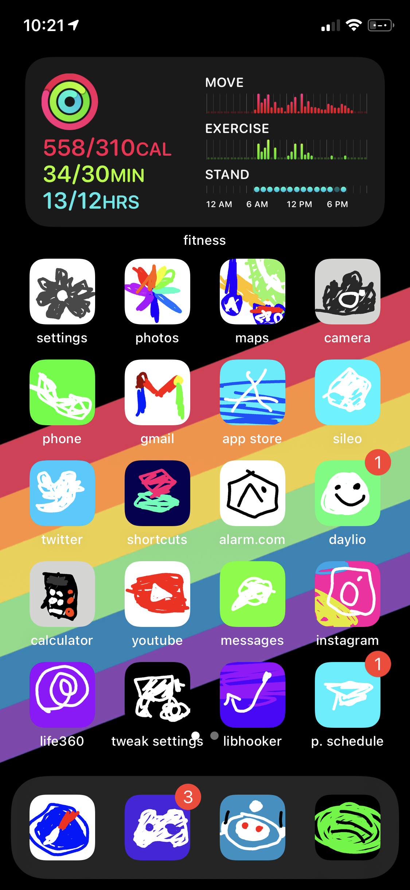

# shitboard
a "very good" snowboard ios theme
## style guide (if you want to make your own icon)
- 512x512 icons
- only use the fill bucket for the background
- only use freestyle pencil tool (ie no line tool) for everything else, ideally drawn with a mouse
- no gradients
    - if there's a **strong** gradient, use the pencil tool to draw it (eg instagram)
- only use stroke width of 23 unless fine detail is necessary (eg the clock)
    - why? Cause that's what it was set to when I made it don't ask
- icon should resemble original icon enough to be recognizable
- any solid color other than the background should be poorly filled in with the pencil tool as if drawn by a kindergartner (try to stay within the lines though)
- icons with faces can have the expression changed for comedic effect
- icons with text can be misspelled or changed for comedic effect (ie calendar)

